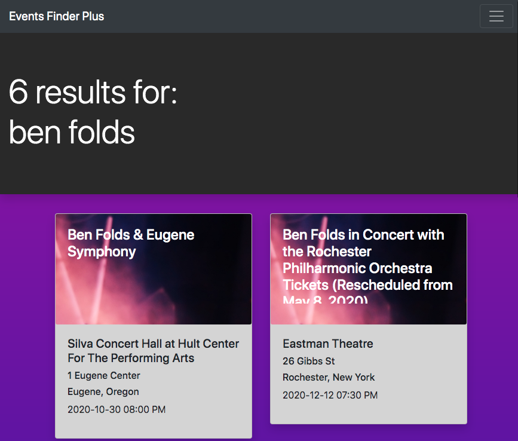
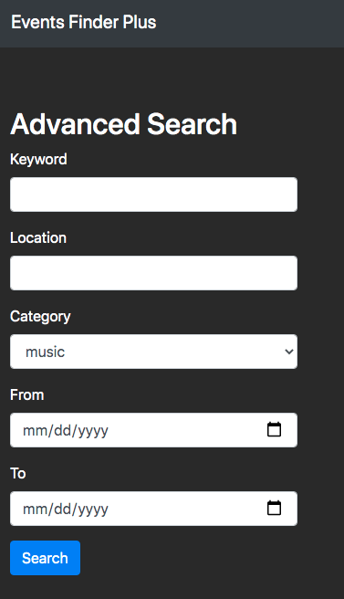
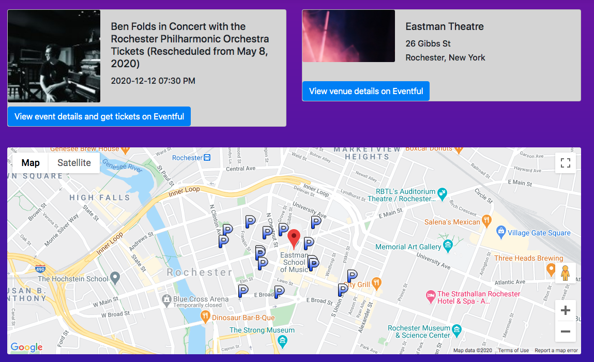
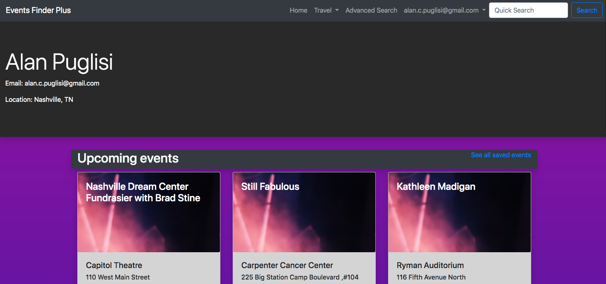

## Events Finder Plus  
https://eventsfinderplus.herokuapp.com/

Events Finder Plus is an event search app.  Users can perform a quick search or an advanced search that will filter by location, date, or category.  Selecting an event returns the event info, venue details, as well as parking options around the venue.  

  

  

  

  

Users can also create an account to save events and view upcoming events in their area.  

## Built Using
Languages:

- HTML/CSS
- Javascript
- Python

Framework:

- Flask
 - Flask Login
 - FlaskWTForms
- Bootstrap

Database:

- PostgreSQL
- Flask SQLAlchemy  

Password Hashing:  

- BCrypt  

APIs used:  

- Eventful API  
- Google MAPS Javscript API
- Google Places API

